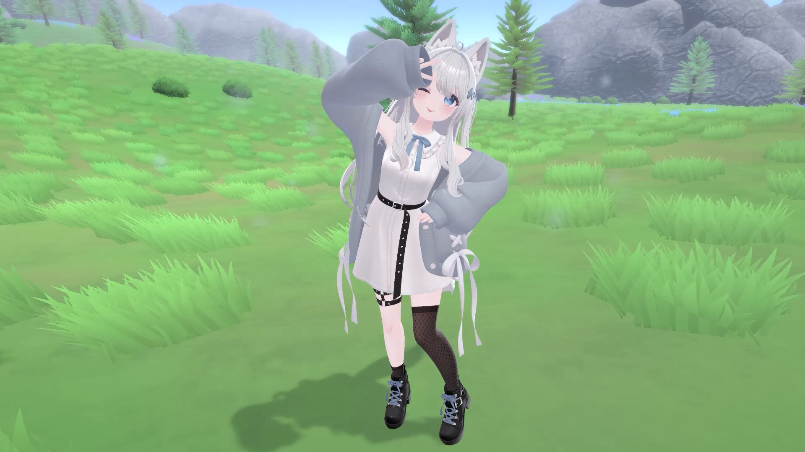

# 作品名



## Overview

Unityで制作した、短尺の3Dキャラクター演出ポートフォリオです。  
キャラクターアニメーション、カメラ、ライティング、エフェクト、サウンドを統合し、約20秒の演出シーンとして構成しています。

本作品では、3Dキャラクター表現とUnity上での演出制御を組み合わせ、短い時間で作品の雰囲気・動き・見せ場が伝わることを目指しました。

## Demo

[作品デモ動画](./Videos/demo.mp4)

## Features

- Unity上での3Dキャラクター演出シーン構築
- Blenderで作成したアニメーションのUnity連携
- lilToonを使用したアニメ風の質感表現
- ライティング、エフェクト、サウンドによる演出調整
- C#スクリプトによる一部演出制御

## Repository Contents

```txt
PortfolioRepository/
├─ Docs/
│  ├─ Credits.md
│  └─ TechnicalNote.md
├─ Images/
│  └─ thumbnail.png
├─ Scripts/
│  └─ 自作C#スクリプト
├─ Videos/
│  └─ demo.mp4
└─ README.md
```

## Documents

- [技術資料](./Docs/TechnicalNote.md)
- [使用素材・クレジット](./Docs/Credits.md)

## Source Code

本リポジトリでは、作品内で使用した自作C#スクリプトを `Scripts/` 配下に掲載しています。

## Note

本作品では再配布不可の有料アセットを使用しているため、Unityプロジェクト本体は公開していません。  
代わりに、デモ動画、技術資料、使用素材一覧、自作スクリプトを掲載しています。

面接時には、ローカル環境上でUnityプロジェクトの構成をお見せすることが可能です。